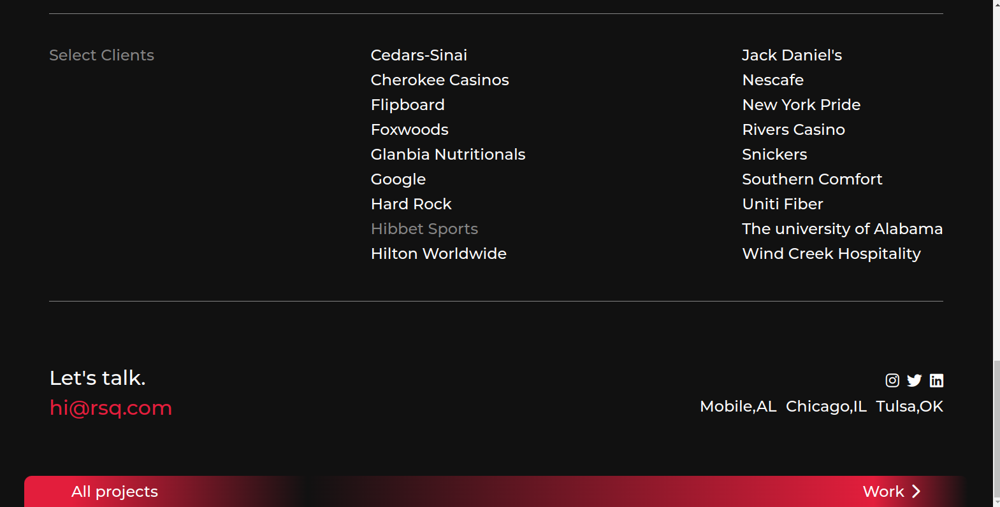

<h1 align="center"> Red Square Agency </h1>

Solution for a challenge from <a href="https://www.frontendpractice.com/projects/red-square">frontendpractice.com</a>

<h3> <a href="https://thuri10.github.io/redsquare">Demo
|
<a href="https://github.com/thuri10/redsquare">Solution</a>
</h3>

## Overview
Red Square Agency is a level 1 project from Frontend Pratice website whose goal is to learn about
1. Minimal design
2. Scroll Animations
3. Hover Effects
4. FlexBox

## Color Palette 
These are the color codes used in development of the design.
- #e31e3c
- #111111
- #fefefe
- #858585

## Experience
Good in understanding the flexbox Layout Model and Responsive Layout using different Media.

## Built With
- HTML
- CSS

